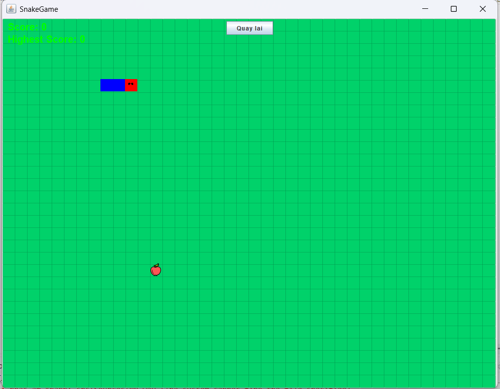
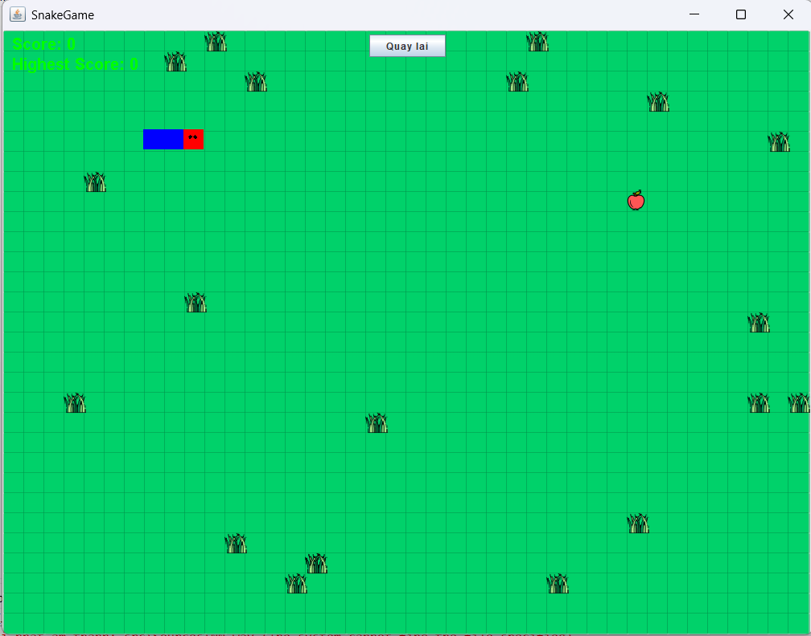
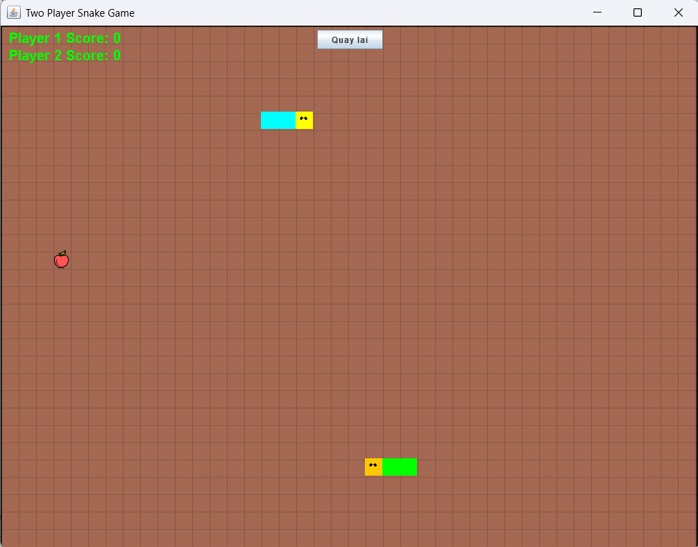
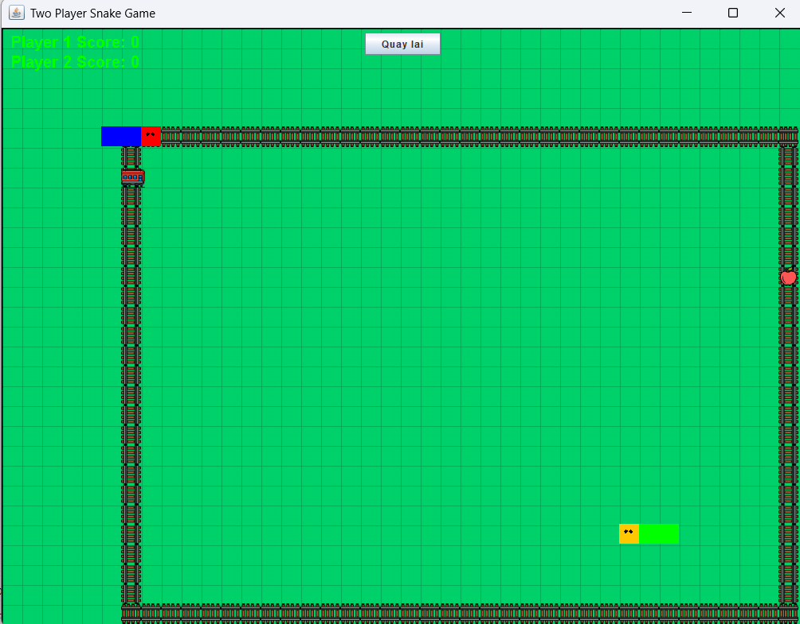

# 🐍 Snake Game - Java Swing (MVC Architecture)


  **Snake Game** một trò chơi Rắn Săn Mồi kinh điển, được xây dựng bằng ngôn ngữ **Java** với giao diện **Swing** và kiến trúc **MVC (Model-View-Controller)**.

## Hình ảnh minh họa (Screenshots)

Dưới đây là một số hình ảnh thực tế từ trò chơi:

| Chế độ 1 Người chơi | Chế độ 1 Người chơi (Có vật cản) |
|:---:|:---:|
|  |  |
| *Giao diện chơi đơn cổ điển* | *Thử thách với chướng ngại vật* |

| Chế độ 2 Người chơi | Chế độ 2 Người chơi (Có tàu hỏa) |
|:---:|:---:|
|  |  |
| *Hai người cùng săn mồi* | *Kịch tính với tàu hỏa chạy qua* |

## Tính năng nổi bật

Trò chơi bao gồm các tính năng chính sau:

* **Các chế độ chơi:**
    * **1 Player (Một người chơi):** Săn mồi và ghi điểm cao nhất.
    * **2 Players (Hai người chơi):** Chế độ đối kháng, hai người cùng chơi trên một bàn phím.
    * **Chế độ Có/Không có chướng ngại vật (With/No Obstacles):** Tăng độ khó với các tảng đá ngẫu nhiên.
* **Thử thách Tàu hỏa (Train Mode):** Trong chế độ 2 người chơi đặc biệt (`TwoSnakePanel_2`), xuất hiện tàu hỏa chạy qua bản đồ, tăng tính kịch tính.
* **Vật phẩm:**
    * **Táo đỏ:** Tăng 1 điểm.
    * **Táo xanh (Special Food):** Xuất hiện ngẫu nhiên trong thời gian ngắn, tăng 5 điểm.
* **Âm thanh:**
    * Nhạc nền (`NN.wav`).
    * Hiệu ứng ăn mồi (`Eat.wav`), va chạm (`GameOver.wav`), nhấn phím (`Press.wav`), tiếng tàu hỏa (`tau_hoa.wav`).
* **Lưu điểm cao (High Score):** Tự động cập nhật điểm cao nhất trong phiên chơi.

## Công nghệ sử dụng

* **Ngôn ngữ:** Java (JDK 1.8 trở lên).
* **Giao diện (GUI):** Java Swing (JFrame, JPanel).
* **Kiến trúc:** MVC (Model - View - Controller) giúp code rõ ràng, dễ bảo trì.
    * **Model:** `Snake`, `TwoPlayerSnake`, `TwoPlayerSnake_2` (Xử lý logic game, tọa độ, điểm số).
    * **View:** `SnakePanel`, `MenuPanel`, `TwoSnakePanel` (Hiển thị giao diện, vẽ đồ họa).
    * **Controller:** `SnakeController`, `MenuController`, `TwoSnakeController` (Xử lý sự kiện bàn phím, điều khiển luồng game).
* **Âm thanh:** Java Sound API (`javax.sound.sampled`).
* **IDE hỗ trợ:** Eclipse / IntelliJ IDEA / NetBeans.

## Hướng dẫn cài đặt và Chạy game

### Yêu cầu
* Máy tính đã cài đặt **Java Development Kit (JDK)**.
* Một IDE Java (khuyên dùng **Eclipse** hoặc **IntelliJ IDEA**).

### Các bước thực hiện

1.  **Clone repository:**
    ```bash
    git clone [https://github.com/thanhquan123hi1/snake-game-DSA.git](https://github.com/thanhquan123hi1/snake-game-DSA.git)
    ```

2.  **Mở dự án trong IDE:**
    * Mở Eclipse/IntelliJ -> `Open Project` -> Chọn thư mục vừa clone.

3.  **Cấu hình Build Path (nếu cần):**
    * Đảm bảo thư mục `src` được đánh dấu là Source Root.
    * Đảm bảo thư mục `src/Sources` chứa đầy đủ ảnh và âm thanh.

4.  **Chạy game:**
    * Tìm file `src/TEST/Test.java`.
    * Click chuột phải -> `Run As` -> `Java Application`.

## Hướng dẫn chơi

### Menu chính
* Sử dụng chuột để chọn chế độ chơi và số người chơi.
* Nhấn **Start** để bắt đầu.

### Điều khiển (Controls)

**Chế độ 1 Người chơi:**
* ⬆️ **Mũi tên Lên:** Đi lên
* ⬇️ **Mũi tên Xuống:** Đi xuống
* ⬅️ **Mũi tên Trái:** Sang trái
* ➡️ **Mũi tên Phải:** Sang phải
* **R:** Chơi lại (Reset)
* **E:** Thoát game (Exit)

**Chế độ 2 Người chơi:**
* **Người chơi 1 (Rắn Xanh/Đỏ):** Cụm phím `W`, `A`, `S`, `D`.
* **Người chơi 2 (Rắn Lục/Cam):** Cụm phím Mũi tên `⬆️`, `⬇️`, `⬅️`, `➡️`.
---
*Đây là bài tập môn DSA*
